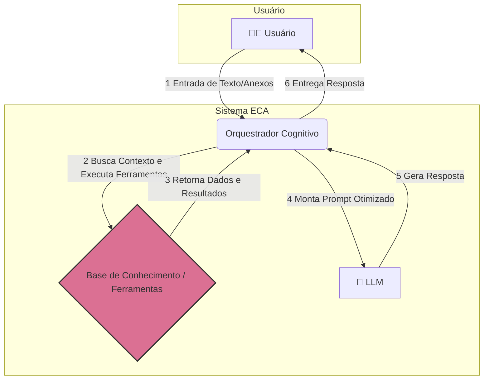
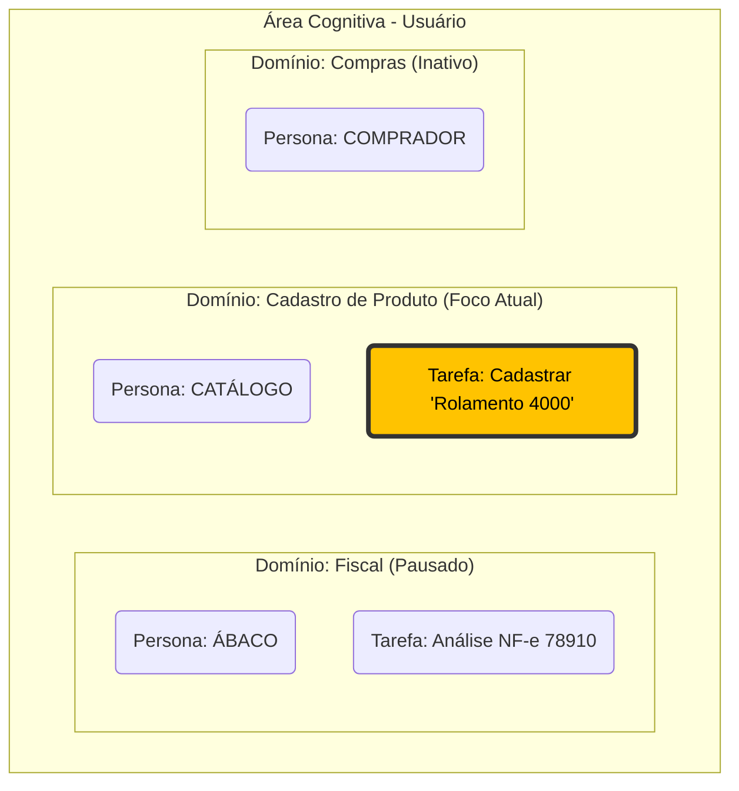

### **ECA: Arquitetura de Engenharia de Contexto Aumentada**

**Versão:** 1.0  
**Autores:** Roberto Timóteo Viera da Silva  
**Data:** 9 de Julho de 2025


-----

### **Índice**

  * [Abstract (Resumo)](#abstract-resumo)
  * [1. Introdução](#1-introdução)
  * [2. Conceitos Fundamentais da ECA](#2-conceitos-fundamentais-da-eca)
  * [3. A Arquitetura ECA em Detalhes](#3-a-arquitetura-eca-em-detalhes)
    * [3.1. A Camada Persistente](#31-a-camada-persistente)
    * [3.2. A Camada de Abstração (O Padrão Adapter)](#32-a-camada-de-abstração-o-padrão-adapter)
    * [3.3. A Camada de Orquestração](#33-a-camada-de-orquestração)
      * [3.3.1. O Mecanismo de Atenção: Focando no Relevante](#331-o-mecanismo-de-atenção-focando-no-relevante)
      * [3.3.2. O Ecossistema de Ferramentas (Tools): Capacidades de Ação e Percepção](#332-o-ecossistema-de-ferramentas-tools-capacidades-de-ação-e-percepção)
    * [3.4. A Camada de Geração de Prompt](#34-a-camada-de-geraçã-de-prompt)
  * [4. Implementação como uma Biblioteca Python (`eca-lib`)](#4-implementação-como-uma-biblioteca-python-eca-lib)
    * [4.1. Exemplo de Uso (Quick Start)](#41-exemplo-de-uso-quick-start)
  * [5. Estudo de Caso: O Assistente de Backoffice Multi-Domínio](#5-estudo-de-caso-o-assistente-de-backoffice-multi-domínio)
  * [6. O Caminho Adiante (The Path Forward)](#6-o-caminho-adiante-the-path-forward)
  * [7. Considerações Finais](#7-considerações-finais)

-----

### Abstract (Resumo)

Grandes Modelos de Linguagem (LLMs) demonstraram capacidades extraordinárias, mas operam sob uma limitação fundamental: são, por natureza, *stateless* (sem estado), resultando em uma amnésia contextual entre interações. Esta limitação impede a construção de agentes de IA verdadeiramente autônomos, capazes de manter conversas fluidas, alternar entre diferentes domínios de conhecimento e simular um raciocínio contínuo. Este artigo introduz a **Engenharia de Contexto Aumentada (ECA)**, uma arquitetura de orquestração projetada para superar essas limitações. A ECA propõe um sistema dinâmico, orientado por metadados, que gera o contexto para o LLM em tempo real. A arquitetura é composta por uma camada persistente de conhecimento (identidades, memórias, regras de negócio), um orquestrador cognitivo que monta uma "Área de Trabalho Cognitiva" com múltiplos domínios ativos, e uma camada de interface que traduz este estado complexo em um prompt otimizado e nativo para o LLM. Apresentamos um estudo de caso de um agente de backoffice multi-domínio para demonstrar a capacidade da ECA em gerenciar a troca de contexto de forma fluida e manter a coerência, representando um passo significativo em direção a assistentes de IA mais robustos e contextualmente conscientes.

-----

### 1\. Introdução

A ascensão dos Grandes Modelos de Linguagem (LLMs) redefiniu as fronteiras da interação humano-computador. No entanto, o paradigma de interação predominante, baseado em prompts isolados, trata o LLM como um processador de linguagem sem estado, incapaz de reter memória, evoluir com o contexto ou gerenciar múltiplas linhas de raciocínio simultaneamente.

Essa limitação fundamental impede o desenvolvimento de aplicações sofisticadas que demandam persistência de estado e raciocínio contextual, como assistentes especializados, sistemas de Automação de Processos de Negócio (BPA) e tutores personalizados.

Para endereçar essa lacuna, propomos a Engenharia de Contexto Aumentada (ECA). A ECA não é um novo modelo de LLM, mas sim uma arquitetura de software e um paradigma de design que funciona como um "exoesqueleto" cognitivo para um LLM pré-existente. O princípio central da ECA é: **o pensamento deve ser gerado a partir da intenção e do contexto, não de uma estrutura codificada.**

Este artigo detalha a arquitetura ECA, sua implementação como uma biblioteca Python flexível (`eca-lib`), e sua aplicação prática.

#### **Diagrama 1: Visão Geral da Arquitetura ECA**



### 2\. Conceitos Fundamentais da ECA

A ECA é construída sobre quatro pilares fundamentais:

  * **Personas Dinâmicas e Orientadas a Dados:** As identidades, regras e objetivos dos agentes não são fixos no código. São tratados como dados, carregados de uma fonte persistente, permitindo que os agentes sejam definidos e modificados sem alterar o código da aplicação.
  * **Memória em Múltiplas Camadas (RAG):** A arquitetura formaliza a memória em dois tipos: uma "memória de trabalho" de curto prazo para a sessão atual e uma memória semântica de longo prazo, alimentada por Geração Aumentada por Recuperação (RAG). Isso permite que os agentes recordem informações passadas relevantes com base na similaridade contextual.
  * **A Área de Trabalho Cognitiva:** O conceito mais inovador da ECA. É uma estrutura de dados em tempo de execução que contém o estado de múltiplos contextos (domínios) simultâneos de um usuário. Permite que um agente "pause" uma tarefa em um domínio (ex: análise fiscal), mude para outro (ex: cadastro de produto) e retorne à primeira tarefa com seu estado totalmente preservado.
  * **Orquestração Desacoplada:** A lógica central (o "Orquestrador") é desacoplada das fontes de dados e ferramentas através do Padrão de Projeto *Adapter*. Isso torna a estrutura agnóstica em relação ao banco de dados, ao *vector store* ou às APIs específicas que está sendo usado.

#### **Diagrama 2: O Conceito da Área de Trabalho Cognitiva**



### 3\. A Arquitetura ECA em Detalhes

A ECA é dividida em camadas lógicas distintas, gerenciadas pelo Orquestrador central.

#### 3.1. A Camada Persistente

Este é o "cérebro de longo prazo" do sistema, armazenado em fontes de dados escolhidas pelo usuário (ex: arquivos JSON, um banco de dados SQL ou NoSQL).

  * **Personas:** Define os agentes que a IA pode incorporar (ex: "ÁBACO"). Contém sua personalidade, objetivos e regras de ouro.
  * **Memórias:** Uma base de conhecimento, idealmente um *vector store*, onde cada entrada é um fato, uma regra de negócio ou um resumo de interação passada, indexada por um vetor de embedding.

#### 3.2. A Camada de Abstração (O Padrão Adapter)

Para garantir a flexibilidade, o Orquestrador não interage diretamente com o banco de dados ou APIs. Ele se comunica através de interfaces abstratas:

  * `PersonaProvider`: Responsável por buscar as definições de persona.
  * `MemoryProvider`: Responsável por buscar memórias relevantes.
  * `SessionProvider`: Responsável por carregar e salvar a Área de Trabalho Cognitiva do usuário.
  * `Tool`: Interface para componentes que interagem com sistemas externos (APIs, arquivos, etc.) para buscar dados em tempo real ou executar ações.

Desenvolvedores podem implementar essas interfaces para qualquer fonte de dados (ex: `JSONMemoryProvider`, `PostgresMemoryProvider`, `WeatherApiTool`).

#### 3.3. A Camada de Orquestração

Esta é a lógica central contida na classe `ECAOrchestrator`. Para cada requisição do usuário, ela executa um ciclo:

1.  **Detecta** a intenção do usuário para determinar o `domínio` ativo.
2.  **Carrega** a `Área de Trabalho Cognitiva` do usuário através do `SessionProvider`.
3.  **Muda o foco** dentro da área de trabalho para o domínio ativo, pausando os outros.
4.  **Busca** memórias de longo prazo relevantes através do `MemoryProvider` e do Mecanismo de Atenção.
5.  **Executa** as `Tools` relevantes para buscar dados externos e em tempo real.
6.  **Monta** o objeto de contexto dinâmico completo em memória.

-----

##### 3.3.1. O Mecanismo de Atenção: Focando no Relevante

A etapa 4 do ciclo do orquestrador (**buscar memórias relevantes**) é o coração do sistema de RAG e é crucial para a qualidade do contexto gerado. Na `eca-lib`, essa função é encapsulada pelo **Mecanismo de Atenção**. Ele é responsável por ranquear um conjunto de memórias candidatas e selecionar as mais pertinentes à entrada do usuário.

Compreendendo que diferentes aplicações possuem requisitos distintos de precisão e custo computacional, a ECA propõe, através da `eca-lib`, uma abordagem flexível com duas implementações distintas deste mecanismo:

**A. Detalhamento: `SimpleSemanticAttention`**

Esta implementação representa a base da capacidade de foco, oferecendo uma solução eficaz com o mínimo de sobrecarga.

  * **O Mecanismo (Similaridade de Sequência):** Utiliza o módulo `difflib` da biblioteca padrão do Python para calcular um "índice de similaridade" literal entre o texto da entrada do usuário e o conteúdo da memória. O algoritmo não compreende o significado, mas é excepcional para encontrar correspondências textuais diretas.
  * **Racionalidade Arquitetural:** Sua inclusão foi motivada por: **Zero Dependências Externas**, **Leveza e Desempenho**, e **Simplicidade e Previsibilidade**.
  * **Benefícios e Casos de Uso:** Ideal para **prototipagem rápida**, **chatbots de FAQ**, e **ambientes com recursos limitados**, onde a velocidade e a facilidade de configuração são prioritárias.

**B. Detalhamento: `VectorizedSemanticAttention`**

Esta é a implementação avançada, projetada para aplicações que necessitam de uma compreensão genuína da intenção do usuário.

  * **O Mecanismo (Similaridade de Cossenos):** Transforma texto em representações numéricas (embeddings) e mede a "proximidade" semântica entre eles usando a **Similaridade de Cossenos**. O design utiliza **Injeção de Dependência**, permitindo que o desenvolvedor forneça qualquer função de embedding (`embedding_function`), desacoplando a `eca-lib` de modelos específicos (OpenAI, Sentence-Transformers, etc.).

    A similaridade de cossenos é definida por:
    $$\text{similarity}(\vec{A}, \vec{B}) = \cos(\theta) = \frac{\vec{A} \cdot \vec{B}}{\|\vec{A}\| \|\vec{B}\|}$$

  * **Racionalidade Arquitetural:** Garante **Precisão Semântica**, **Flexibilidade e Prova de Futuro** (agnóstica ao modelo) e **Desacoplamento da Carga Pesada** (a geração dos embeddings).

  * **Benefícios e Casos de Uso:** Essencial para **agentes de IA avançados**, sistemas de **RAG**, e qualquer aplicação que precise lidar com **paráfrases, sinônimos e linguagem natural complexa**.

**Tabela Comparativa dos Mecanismos de Atenção**

| Critério                | `SimpleSemanticAttention`         | `VectorizedSemanticAttention`          |
| :---------------------- | :-------------------------------- | :------------------------------------- |
| **Mecanismo Principal** | Comparação de strings (`difflib`) | Similaridade de cossenos sobre embeddings |
| **Tipo de Correspondência** | Lexical (baseada em palavras)     | Semântica (baseada em significado)     |
| **Precisão** | Baixa a Média                     | Alta a Muito Alta                      |
| **Custo Computacional** | Muito Baixo                       | Moderado a Alto (depende do modelo)    |

Esta abordagem dupla permite que o desenvolvedor da aplicação ECA escolha o mecanismo de atenção que melhor se adapta ao seu balanço entre custo, desempenho e necessidade de compreensão semântica.

-----

##### 3.3.2. O Ecossistema de Ferramentas (Tools): Capacidades de Ação e Percepção

Enquanto o Mecanismo de Atenção capacita o agente a *recordar* informações passadas, o **Ecossistema de Ferramentas** o capacita a **perceber e agir** no mundo exterior em tempo real. Esta é a capacidade que eleva um agente de um "erudito com boa memória" para um "agente de trabalho" capaz de executar tarefas que exigem dados ao vivo ou interações com outros sistemas.

Na arquitetura ECA, uma `Tool` é um componente plugável que estende as habilidades do orquestrador. A biblioteca `eca-lib` formaliza isso através da interface `Tool`, um contrato que obriga cada ferramenta a definir três comportamentos essenciais:

1.  `name`: Um identificador único e textual para a ferramenta (ex: `"weather_tool"`).
2.  `can_handle()`: Um método "gatilho" rápido que avalia se a ferramenta é relevante para a consulta atual do usuário.
3.  `load()`: O método principal que executa a ação da ferramenta (ex: chamar uma API, consultar um banco de dados) e retorna os dados estruturados.

**Controle de Execução de Múltiplas Ferramentas**

Um dos recursos mais avançados do `ECAOrchestrator` é sua capacidade de gerenciar múltiplas ferramentas para uma única consulta. Reconhecendo o trade-off entre a riqueza do contexto e a eficiência (latência, custo), a arquitetura oferece ao desenvolvedor controle total através de um parâmetro de `tool_execution_mode`:

  * `'first_match'` (Padrão): O orquestrador executa apenas a **primeira** ferramenta na sua lista que se declara capaz de lidar com a consulta. Este modo é otimizado para velocidade e eficiência, ideal para interações de intenção única.
  * `'all_matches'`: O orquestrador executa **todas** as ferramentas que se declaram capazes. Este modo é otimizado para a máxima riqueza de contexto, permitindo que o agente responda a consultas complexas e com múltiplas intenções de uma só vez.

A saída de cada ferramenta executada é então injetada no prompt usando uma tag dinâmica e padronizada, como `[INPUT_DATA_NOME_DA_FERRAMENTA:...]`, tornando os dados externos cidadãos de primeira classe no contexto do LLM.

**Diagrama 3: O Ciclo de Raciocínio do Orquestrador**


#### 3.4. A Camada de Geração de Prompt

O resultado do ciclo do orquestrador é um prompt de texto conciso e estruturado, usando tokens especiais (ex: `[IDENTIDADE:...]`, `[MEMÓRIA_RELEVANTE:...]`). Este prompt otimizado, gerado a partir do template mestre, instrui o LLM sobre como raciocinar sobre o contexto fornecido.

```
[INÍCIO_CONTEXTO]
[TIMESTAMP:2025-07-28T14:33:01-03:00]
[IDENTIDADE:ÁBACO|FISCAL|OBJETIVO:Analisar NFs, garantir conformidade e identificar riscos]
[USUÁRIO:Ana|Analista Fiscal Sênior]
[MEMÓRIA_RELEVANTE_1: Fornecedor 'Tecno Peças Ltda' frequentemente apresenta erros no cálculo do IPI na última semana do mês.]
[MEMÓRIA_RELEVANTE_2: Para produtos com NCM iniciado em '8471', a empresa possui um regime especial de tributação de PIS/COFINS.]
[MEMÓRIA_RELEVANTE_3: Regra de Negócio: Toda validação de ICMS-ST deve cruzar a informação com o Protocolo ICMS vigente entre os estados da operação.]
[SESSÃO_ATUAL: Verificação de notas fiscais de entrada do dia 28/07/2025 iniciada.]
[TAREFA_ATIVA: Verificação da Nota Fiscal de Entrada nº 78910 do fornecedor 'Tecno Peças Ltda'.]
[INPUT_DATA_NF_VALIDATOR_TOOL:{"numero_nf":"78910","fornecedor":"Tecno Peças Ltda","produto":"Rolamento Axial 3000","ncm_informado":"8482.10.10","icms_st_informado":432.00,"status_validação":"Pendente"}]
[ENTRADA_USUÁrio: "Ábaco, por favor, analise a NF-e 78910. Verifique o destaque do ICMS-ST e confira se o NCM do produto 'Rolamento Axial 3000' está correto de acordo com nossas regras de negócio."]
[FIM_CONTEXTO]
```

Este formato denso e estruturado reduz a carga cognitiva do LLM, focando sua atenção nos elementos mais pertinentes e melhorando drasticamente a qualidade e a relevância da resposta final.

### 4\. Implementação como uma Biblioteca Python (`eca-lib`)

Para tornar esta arquitetura prática, nós a projetamos como uma biblioteca Python, a `eca-lib`. A filosofia da biblioteca é ser não opinativa e fornecer um toolkit robusto para desenvolvedores.

O princípio chave é a **separação de responsabilidades**:

  * **A Biblioteca (`eca/`):** Contém a lógica central e reutilizável: `ECAOrchestrator`, `CognitiveWorkspace` e as classes base dos `Adapters` e `Tools`. Ela é agnóstica ao domínio e aos dados.
  * **A Aplicação (`examples/`):** Este é o código que o usuário final escreve. O usuário implementa as interfaces dos `Adapters` para se conectar aos seus próprios bancos de dados e as interfaces de `Tools` para interagir com suas APIs, fornecendo também seus próprios dados de `personas.json` e `memories.json`.

Essa separação permite que os desenvolvedores aproveitem a poderosa lógica de orquestração da ECA, mantendo total controle sobre seus dados e infraestrutura.

#### 4.1. Exemplo de Uso (Quick Start)

Abaixo, um exemplo prático e completo que simula uma conversa real, demonstrando a detecção de domínio, o uso de memória de longo prazo (RAG), a execução de ferramentas para buscar dados em tempo real e a capacidade de retornar a um contexto pausado.

```python
# main.py
import json
import io
from eca import ECAOrchestrator
from eca.attention import SimpleSemanticAttention
from eca.adapters import JSONPersonaProvider, JSONMemoryProvider, JSONSessionProvider, Tool
from typing import Any, Dict, Optional

# --- 1. Definição de Ferramentas e Dados (para um exemplo auto-contido) ---

class SalesTool(Tool):
    """Ferramenta que simula a busca por dados de vendas em tempo real."""
    name = "sales_analyzer"
    
    def can_handle(self, user_input: str, attachment: Optional[Any] = None) -> bool:
        """Acionada por palavras-chave relacionadas a vendas e relatórios."""
        return "vendas" in user_input.lower() or "relatório" in user_input.lower()

    def load(self, user_input: str, attachment: Optional[Any] = None) -> Optional[Dict[str, Any]]:
        """Simula a busca dos dados de vendas do dia."""
        print("[Engine INFO: Ferramenta SalesTool foi executada]")
        return {"total_sales_today": 15750.80, "top_product": "Rolamento 4000", "ytd_goal_percentage": "95.7%"}

class HRTool(Tool):
    """Ferramenta que simula a consulta de informações de RH."""
    name = "hr_database"
    
    def can_handle(self, user_input: str, attachment: Optional[Any] = None) -> bool:
        """Acionada por palavras-chave relacionadas a RH e funcionários."""
        return "férias" in user_input.lower() or "funcionário" in user_input.lower()

    def load(self, user_input: str, attachment: Optional[Any] = None) -> Optional[Dict[str, Any]]:
        """Simula a busca dos dias de férias de um funcionário."""
        print("[Engine INFO: Ferramenta HRTool foi executada]")
        return {"employee": "Carlos Magno", "vacation_days_remaining": 12, "next_vacation_scheduled": "2025-12-15"}

# Usamos estruturas de dados para representar a Persona
PERSONAS_DATA = json.dumps([
  {
    "id": "sales_agent",
    "name": "VENDAX",
    "semantic_description": "Análise de dados de vendas, relatórios, faturamento, KPIs comerciais, metas de vendas.",
    "persona_config": {
      "persona": "Você é VENDAX, um analista de vendas IA de alta performance.",
      "objective": "Analisar dados de vendas em tempo real, identificar tendências e relatar KPIs de forma clara e objetiva.",
      "golden_rules": [
          "Sempre forneça o percentual da meta atingido no ano (YTD).",
          "Seja proativo e aponte o produto de maior destaque."
      ],
      "tone_of_voice": ["Direto", "Focado em dados", "Assertivo", "Profissional"],
      "output_format": "Comece com um resumo executivo de uma frase, seguido por uma lista de pontos-chave (bullet points).",
      "forbidden_topics": ["Especulação de mercado", "Conselhos de investimento financeiro", "Comentários negativos sobre concorrentes"],
      "verbosity": "concise"
    }
  },
  {
    "id": "hr_assistant",
    "name": "RH-BOT",
    "semantic_description": "Recursos humanos, RH, férias, funcionários, benefícios, políticas internas.",
    "persona_config": {
      "persona": "Você é RH-BOT, um assistente de RH prestativo e confidencial.",
      "objective": "Responder perguntas sobre políticas de RH e informações de funcionários.",
      "golden_rules": [
          "Nunca compartilhe informações salariais.",
          "Sempre trate os dados dos funcionários com confidencialidade."
      ],
      "tone_of_voice": ["Empático", "Formal", "Acolhedor", "Confidencial"],
      "output_format": "Forneça a resposta direta. Em seguida, em uma nova linha, cite a política interna relevante no formato 'Fonte: [Nome da Política]'.",
      "forbidden_topics": ["Informações pessoais de outros funcionários", "Conselhos médicos ou legais", "Opinião sobre políticas da empresa"],
      "verbosity": "normal"
    }
  }
])

MEMORY_DATA = json.dumps([
  {
    "id": "mem-sales-001",
    "domain_id": "sales_agent",
    "type": "insight",
    "text_content": "O produto 'Rolamento 4000' teve um pico de vendas inesperado no último trimestre, investigar a causa."
  },
  {
    "id": "mem-hr-001",
    "domain_id": "hr_assistant",
    "type": "policy",
    "text_content": "A política de férias da empresa permite o agendamento com no mínimo 30 dias de antecedência."
  }
])

# --- 2. Instanciação dos Componentes da ECA ---

sales_tool = SalesTool()
hr_tool = HRTool()
attention = SimpleSemanticAttention()

# Usamos io.StringIO para que os Provedores leiam as strings como se fossem arquivos
persona_provider = JSONPersonaProvider(file_path=io.StringIO(PERSONAS_DATA))
memory_provider = JSONMemoryProvider(semantic_path=io.StringIO(MEMORY_DATA), attention_mechanism=attention)
# O SessionProvider pode começar vazio e salvará o estado na memória
session_provider = JSONSessionProvider(file_path=io.StringIO(json.dumps({})))

# --- 3. Injeção de Dependências no Orquestrador ---
orchestrator = ECAOrchestrator(
    persona_provider=persona_provider,
    memory_provider=memory_provider,
    session_provider=session_provider,
    tools=[sales_tool, hr_tool] # Lista de todas as ferramentas disponíveis
)
print("✅ Orquestrador ECA pronto. Iniciando simulação de conversa...\n")

# --- 4. Simulação da Conversa Multi-Turno ---
user_id = "ana_paula"

# --- TURNO 1: Foco em Vendas ---
print("----------------------------------------------------")
print("🔷 TURNO 1: Foco em Vendas 🔷")
user_input_1 = "VendaX, pode me passar o relatório de vendas de hoje?"
print(f"🗣️  USUÁRIO: '{user_input_1}'")
prompt_1 = orchestrator.generate_final_prompt(user_id=user_id, user_input=user_input_1)

workspace = orchestrator.workspace_manager.get_workspace(user_id)
print(f"\n✨ ECA em Ação:")
print(f"  - Persona Ativa: {workspace.current_focus} (Correto!)")
print(f"  - Ferramenta Executada: {'INPUT_DATA_SALES_ANALYZER' in prompt_1} (Buscou os KPIs de vendas)")
print("----------------------------------------------------\n")


# --- TURNO 2: Troca de Contexto para RH ---
print("----------------------------------------------------")
print("🔷 TURNO 2: Troca de Contexto para RH 🔷")
user_input_2 = "Obrigada. Agora, por favor, verifique o saldo de férias do Carlos Magno."
print(f"🗣️  USUÁRIO: '{user_input_2}'")
prompt_2 = orchestrator.generate_final_prompt(user_id=user_id, user_input=user_input_2)

workspace = orchestrator.workspace_manager.get_workspace(user_id)
print(f"\n✨ ECA em Ação:")
print(f"  - Persona Ativa: {workspace.current_focus} (Correto! Mudou para o assistente de RH)")
print(f"  - Memória Relevante: {'política de férias' in prompt_2} (Buscou a regra sobre agendamento)")
print(f"  - Ferramenta Executada: {'INPUT_DATA_HR_DATABASE' in prompt_2} (Consultou o banco de dados de RH)")
print("----------------------------------------------------\n")


# --- TURNO 3: Retorno ao Contexto de Vendas ---
print("----------------------------------------------------")
print("🔷 TURNO 3: Retorno ao Contexto de Vendas 🔷")
user_input_3 = "Perfeito. Voltando ao relatório, aquele produto em destaque, o 'Rolamento 4000', tem algum histórico relevante?"
print(f"🗣️  USUÁRIO: '{user_input_3}'")
prompt_3 = orchestrator.generate_final_prompt(user_id=user_id, user_input=user_input_3)

workspace = orchestrator.workspace_manager.get_workspace(user_id)
print(f"\n✨ ECA em Ação:")
print(f"  - Persona Ativa: {workspace.current_focus} (Correto! Voltou a ser o analista de vendas)")
print(f"  - Memória Relevante: {'pico de vendas inesperado' in prompt_3} (A Área de Trabalho Cognitiva lembrou do contexto anterior e buscou um insight relevante!)")
print("----------------------------------------------------\n")
```

### 5\. Estudo de Caso: O Assistente de Backoffice Multi-Domínio

Para validar a arquitetura e demonstrar seu poder na prática, simulamos uma conversa com uma assistente de IA multi-talentosa, utilizada por uma usuária chamada Ana. O cenário reflete exatamente o código apresentado na seção *Quick Start*.

A assistente possui duas personas distintas pré-configuradas: **"VENDAX"**, uma analista de vendas focada em dados, e **"RH-BOT"**, uma especialista em recursos humanos.

A conversa se desenrola em três turnos, destacando a capacidade da ECA de gerenciar o contexto de forma fluida:

1.  **Interação 1 (Domínio: `sales_agent`):** Ana inicia a conversa focada em vendas: *"VendaX, pode me passar o relatório de vendas de hoje?"*. O Orquestrador ECA:

      * **Detecta** a intenção "vendas" e ativa a persona **VENDAX**.
      * **Executa** a `SalesTool`, que busca os KPIs de vendas do dia em tempo real.
      * **Monta** um prompt que instrui o LLM a agir como VENDAX e a usar os dados da ferramenta para formular a resposta. O estado da tarefa "relatório de vendas" é salvo na Área de Trabalho Cognitiva.

2.  **Interação 2 (Troca de Contexto para `hr_assistant`):** Ana muda abruptamente de assunto: *"Obrigada. Agora, por favor, verifique o saldo de férias do Carlos Magno."*. O Orquestrador ECA:

      * **Detecta** a nova intenção "férias" e muda o foco para o domínio **RH**.
      * **Pausa** o estado do domínio `sales_agent`, preservando todo o seu contexto.
      * **Ativa** a persona **RH-BOT**, carregando suas regras de confidencialidade e tom empático.
      * **Busca** na memória de longo prazo (RAG) e encontra uma política relevante sobre o agendamento de férias.
      * **Executa** a `HRTool` para consultar o banco de dados de funcionários.
      * **Gera** um prompt completo para o RH-BOT, contendo a política da empresa e os dados do funcionário.

3.  **Interação 3 (Retorno ao Contexto de Vendas):** Ana finaliza a consulta de RH e retorna ao seu pensamento original: *"Perfeito. Voltando ao relatório, aquele produto em destaque, o 'Rolamento 4000', tem algum histórico relevante?"*. O Orquestrador ECA:

      * **Detecta** a intenção de retorno com a frase "Voltando ao relatório...".
      * **Restaura** o foco para o domínio `sales_agent`. O estado da tarefa "relatório de vendas", que estava pausado, volta a ficar ativo.
      * **Reativa** a persona **VENDAX**.
      * **Busca** na memória de longo prazo usando o novo contexto ("Rolamento 4000") e encontra um *insight* estratégico sobre um pico de vendas passado para aquele produto.
      * **Gera** um novo prompt para VENDAX, permitindo que o LLM continue a conversa original com memória total, como se nunca tivesse sido interrompido.

Este estudo de caso demonstra a capacidade central da ECA: gerenciar conversas complexas e com múltiplos tópicos de forma transparente para o usuário. A **Área de Trabalho Cognitiva** funciona como a memória de trabalho de um ser humano, permitindo que o agente de IA pause tarefas, mude de foco e retorne a elas com seu contexto perfeitamente preservado, resultando em interações drasticamente mais naturais e eficientes.

### 6\. Trabalhos Futuros e Direções

A arquitetura ECA fornece uma base sólida para exploração futura:

  * **Adaptadores Avançados:** Desenvolvimento de um ecossistema rico de adaptadores para bancos de dados populares (Postgres, MongoDB) e *vector stores* (Pinecone, Chroma).
  * **Ecossistema de Ferramentas:** Criação de uma biblioteca de `Tools` pré-construídas para tarefas comuns (ex: busca na web, leitura de arquivos, calculadora).
  * **Gerenciamento de Memória:** Implementação de mecanismos sofisticados de "esquecimento" para podar informações irrelevantes ou desatualizadas.
  * **Comunicação Inter-Domínios:** Permitir que agentes "conversem" entre si dentro da área de trabalho para resolver problemas inter-funcionais.

### 7\. Conclusão

A Engenharia de Contexto Aumentada (ECA) oferece um paradigma estruturado e escalável para construir a próxima geração de agentes de IA. Ao formalizar o gerenciamento de identidade, memória e estado através de uma camada de orquestração desacoplada, do inovador conceito de "Área de Trabalho Cognitiva", e da capacidade de interagir com o mundo exterior através de um ecossistema de ferramentas extensível, a ECA transforma LLMs de ferramentas reativas em parceiros de trabalho proativos, com estado (*stateful*) e contextualmente conscientes. Acreditamos que esta abordagem é um passo fundamental para a realização de interações de IA mais capazes e inteligentes.