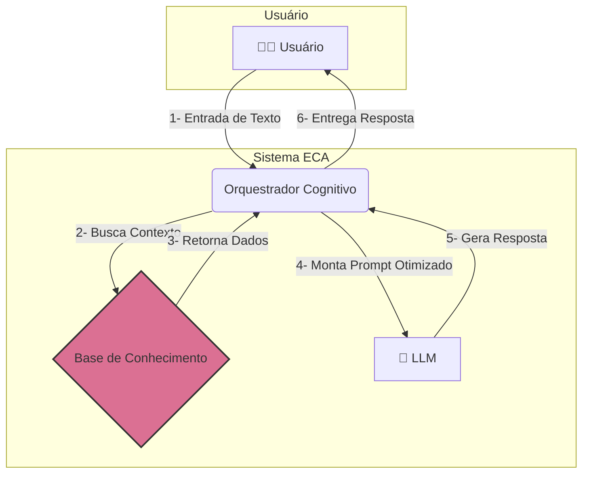

# 🧠 ECA-Lib: Engenharia de Contexto Aumentada


**ECA-Lib** é a implementação da arquitetura ECA, um paradigma para projetar e construir aplicações de IA stateful (com estado) sobre Grandes Modelos de Linguagem. A biblioteca fornece um sistema estruturado para a engenharia de contexto, permitindo que LLMs operem com memória de longo prazo e capacidade de multitarefa.

---

### 💥 O Problema: A Natureza Stateless dos LLMs e sua Amnésia

Grandes Modelos de Linguagem (LLMs) são incrivelmente poderosos, mas operam com uma limitação fundamental: por natureza, eles são stateless (sem estado). Eles não possuem memória entre as interações, o que torna um desafio construir aplicações de IA stateful que evoluem, aprendem com o passado e gerenciam tarefas complexas de forma contínua.

### ✨ A Solução: Arquitetura ECA

A **ECA (Engenharia de Contexto Aumentada)** é uma arquitetura de orquestração que resolve esse problema. Funciona como um "exoesqueleto" cognitivo para LLMs, fornecendo um sistema estruturado para a engenharia de contexto, onde a identidade, a memória e o estado são tratados como componentes de primeira classe. Ela orquestra a identidade, a memória e o foco do agente, gerando um prompt rico e dinâmico em tempo real.

Com a ECA, um agente de IA pode:

* ✅ **Gerenciamento de Identidade:** Permite a definição de múltiplas personas (com identidades, objetivos e regras próprias) que são carregadas dinamicamente. Isso torna o comportamento da IA configurável e não codificado, podendo agir como um especialista fiscal em um momento e como um organizador de catálogos no outro.
* 🧠 **Memória Híbrida e Persistente:** Implementa uma memória de longo prazo (semântica) via RAG (Geração Aumentada por Recuperação) e uma memória de curto prazo (episódica), permitindo que a aplicação consulte e "lembre" de fatos e interações passadas.
* 🚀 **Raciocinar Dinamicamente:** Alternar entre diferentes tarefas sem perder o contexto, utilizando uma "Área de Trabalho Cognitiva" que gerencia múltiplos domínios de foco. Introduzindo um sistema de gerenciamento de estado que permite à aplicação pausar uma tarefa, focar em outra e retornar ao contexto original sem perda de informação, simulando uma capacidade de raciocínio dinâmico.
* ⚙️ **Ser Orientado por Dados:** Definir personas, regras e memórias em arquivos de configuração, não em código rígido. Toda a lógica de comportamento (personas, regras, memórias) é tratada como dados, desacoplando a lógica da aplicação de suas fontes de conhecimento e permitindo máxima flexibilidade através de uma arquitetura de adaptadores.

### Diagrama da Arquitetura


### 📦 Instalação

```bash
pip install eca-lib
```
*(Nota: O pacote está em processo de publicação no PyPI)*

### 🚀 Quick Start

Este exemplo mostra como instanciar o orquestrador e gerar um prompt dinâmico.

1.  **Crie seus arquivos de dados** (veja a pasta `/examples` para os formatos):
    * `personas.json`: Define as identidades da sua IA.
    * `memories.json`: Sua base de conhecimento semântico.
    * `sessions.json`: Onde o estado das conversas será salvo (pode começar vazio).
    * `meta_prompt.txt`: O template mestre do seu prompt, contendo a variável `{{DYNAMIC_CONTEXT}}`.

2.  **Execute o código Python:**

```python
# Importe as classes necessárias
from eca import ECAOrchestrator
from eca.adapters import JSONPersonaProvider, JSONMemoryProvider, JSONSessionProvider

# Apontar para os arquivos de dados da sua aplicação
base_path = 'examples/database/'
personas_file = base_path + 'personas.json'
memories_file = base_path + 'memories.json'
sessions_file = base_path + 'interaction_log.json' # Onde as conversas são salvas
meta_prompt_file = 'eca/prompts/meta_prompt_template_pt_BR.txt'

# Instancie os provedores (Adapters)
persona_provider = JSONPersonaProvider(file_path=personas_file)
# Nota: O JSONMemoryProvider real usa semantic_path e episodic_path
memory_provider = JSONMemoryProvider(semantic_path=memories_file, episodic_path=sessions_file)
session_provider = JSONSessionProvider(file_path='examples/workspaces/user_sessions.json')

# Injetar os provedores no Orquestrador
orchestrator = ECAOrchestrator(
    persona_provider=persona_provider,
    memory_provider=memory_provider,
    session_provider=session_provider,
    meta_prompt_template_path=meta_prompt_file,
    knowledge_base_path='examples/knowledge_base' # Para dados de tarefas
)

# Processe a entrada do usuário
user_id = "ana_paula"
user_input = "Preciso cadastrar um novo produto no sistema."

# Gere o prompt final, pronto para o LLM
final_prompt = orchestrator.generate_final_prompt(user_id, user_input)

print(final_prompt)
```

### 📖 Documentação Completa

Para um mergulho profundo na teoria e nos detalhes da arquitetura, leia nosso **[Whitepaper de Arquitetura](ARCHITECTURE.md)**.

### 🤝 Como Contribuir

Contribuições são bem-vindas! Por favor, sinta-se à vontade para abrir uma *issue* ou enviar um *pull request*.

### 📜 Licença

Este projeto é licenciado sob a Licença MIT. Veja o arquivo [LICENSE](LICENSE) para mais detalhes.
