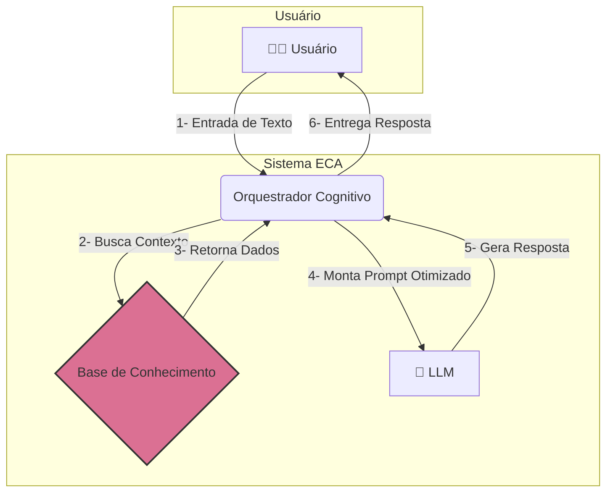

# 🧠 ECA-Lib: Engenharia de Contexto Aumentada


**ECA-Lib** é a implementação da arquitetura ECA, um paradigma para projetar e construir aplicações de IA stateful (com estado) sobre Grandes Modelos de Linguagem. A biblioteca fornece um sistema estruturado para a engenharia de contexto, permitindo que LLMs operem com memória de longo prazo e capacidade de multitarefa.

---

### 💥 O Problema: A Natureza Stateless dos LLMs e sua Amnésia

Grandes Modelos de Linguagem (LLMs) são incrivelmente poderosos, mas operam com uma limitação fundamental: por natureza, eles são stateless (sem estado). Eles não possuem memória entre as interações, o que torna um desafio construir aplicações de IA stateful que evoluem, aprendem com o passado e gerenciam tarefas complexas de forma contínua.

### ✨ A Solução: Arquitetura ECA

A **ECA (Engenharia de Contexto Aumentada)** é uma arquitetura de orquestração que resolve esse problema. Funciona como um "exoesqueleto" cognitivo para LLMs, fornecendo um sistema estruturado para a engenharia de contexto, onde a identidade, a memória e o estado são tratados como componentes de primeira classe. Ela orquestra a identidade, a memória e o foco do agente, gerando um prompt rico e dinâmico em tempo real.

Com a ECA, é possível projetar sistemas com as seguintes capacidades:

* ✅ **Gerenciamento de Identidade:** Permite a definição de múltiplas personas (com identidades, objetivos e regras próprias) que são carregadas dinamicamente. Isso torna o comportamento da IA configurável e não codificado, podendo agir como um especialista fiscal em um momento e como um organizador de catálogos no outro.
* 🧠 **Memória Híbrida e Persistente:** Implementa uma memória de longo prazo (semântica) via RAG (Geração Aumentada por Recuperação) e uma memória de curto prazo (episódica), permitindo que a aplicação consulte e "lembre" de fatos e interações passadas.
* 🚀 **Raciocinar Dinamicamente:** Alternar entre diferentes tarefas sem perder o contexto, utilizando uma "Área de Trabalho Cognitiva" que gerencia múltiplos domínios de foco. Introduzindo um sistema de gerenciamento de estado que permite à aplicação pausar uma tarefa, focar em outra e retornar ao contexto original sem perda de informação, simulando uma capacidade de raciocínio dinâmico.
* ⚙️ **Ser Orientado por Dados:** Definir personas, regras e memórias em arquivos de configuração, não em código rígido. Toda a lógica de comportamento (personas, regras, memórias) é tratada como dados, desacoplando a lógica da aplicação de suas fontes de conhecimento e permitindo máxima flexibilidade através de uma arquitetura de adaptadores.

### Diagrama da Arquitetura


Entendido\! Ótima ideia. Criar uma analogia forte como essa no README é uma maneira fantástica de tornar conceitos técnicos complexos muito mais intuitivos para novos usuários e contribuidores.

Vocês têm a chamada para a ação, agora vamos criar o conteúdo que ela promete.

Abaixo está uma proposta completa para essa nova seção do seu `README.md`. Você pode copiar e colar diretamente no seu arquivo.

-----

### A Analogia do Chef de Cozinha: Entendendo o Fluxo de Raciocínio da `eca-lib`

Para tornar os conceitos da Arquitetura ECA (Engenharia de Contexto Aumentada) mais intuitivos, criamos a analogia de um Chef de Cozinha trabalhando em uma cozinha profissional de alta performance.

  - **O Chef de Cozinha** é o **LLM** (como o GPT, Llama, etc.). Ele é o mestre da criatividade e do raciocínio, capaz de transformar ingredientes brutos em pratos incríveis. No entanto, sem uma boa cozinha, até o melhor Chef do mundo fica limitado.

  - **A Cozinha Profissional** é a **`eca-lib`**. Ela é todo o ambiente, as ferramentas e os processos organizados que dão superpoderes ao Chef, permitindo que ele execute pratos complexos, atenda múltiplos pedidos e mantenha a consistência.

#### O Fluxo de Raciocínio Passo a Passo:

**1. O Pedido Chega (O `prompt` do Usuário)**
Um cliente faz um pedido no restaurante. Esse pedido é o `prompt` inicial. Ele pode ser simples ("Quero uma salada") ou complexo ("Quero o prato do dia, mas sou alérgico a nozes e gostaria de trocar o acompanhamento por batatas rústicas").

**2. O Chef Consulta a Memória (Memória Híbrida)**
Antes de começar, o Chef ativa sua memória:

  - **Memória de Curto Prazo (Histórico da Conversa):** Ele pega seu bloco de anotações para lembrar os detalhes imediatos do pedido: "Ok, cliente da mesa 4, sem nozes, com batatas rústicas". Ele sabe tudo o que foi dito nos últimos minutos.
  - **Memória de Longo Prazo (Base de Conhecimento / RAG):** Para o "prato do dia", ele não tenta inventar. Ele vai até sua estante e consulta o livro de receitas (sua base de conhecimento vetorial). Ele "recupera" a receita exata, garantindo que o prato saia perfeito, como sempre.

**3. A Bancada de Trabalho Organizada (Área de Trabalho Cognitiva)**
O Chef não trabalha de forma caótica. Sua bancada (`mise en place`) é a **Área de Trabalho Cognitiva**.

  - **Multitarefa Real:** Ele pode estar dourando um filé (Tarefa A). Enquanto o filé descansa, ele se vira para cortar os vegetais da salada (Tarefa B). Ele não esqueceu do filé; o "estado" daquela tarefa (tempo de descanso, temperatura) está preservado em um canto específico da bancada. A `eca-lib` permite que o LLM faça o mesmo: pausar uma linha de raciocínio complexa para resolver uma subtarefa, e depois voltar exatamente de onde parou.

**4. As Ferramentas e a Despensa (Adaptadores de Produção)**
Um Chef depende de suas ferramentas e de uma despensa bem organizada.

  - **PostgreSQL/pgvector (A Despensa Refrigerada):** É o seu grande estoque de ingredientes de longo prazo, perfeitamente catalogado. O `pgvector` é como ter os ingredientes organizados por "perfil de sabor" ou "tipo de culinária", permitindo encontrar ingredientes similares de forma rápida e eficiente.
  - **Redis (O "Mise en Place" Rápido):** É o pequeno refrigerador ao lado do fogão, com os ingredientes mais usados já pré-cortados e prontos para uso imediato. O Redis funciona como essa memória cache de alta velocidade para informações que precisam ser acessadas instantaneamente.

**5. O Prato Final (A Resposta da IA)**
Após orquestrar todos esses elementos – consultar suas memórias, usar sua bancada para múltiplas etapas e pegar ingredientes de sua despensa – o Chef monta o prato. A resposta final da IA não é apenas uma informação jogada, mas um "prato" bem construído, contextual e que atende a todos os requisitos do pedido inicial.

-----

#### Tabela Resumo da Analogia

| Conceito da `eca-lib` | Analogia na Cozinha |
| :---------------------- | :-------------------- |
| **LLM** | O Chef de Cozinha |
| **`eca-lib`** | A Cozinha Profissional Completa |
| **Prompt do Usuário** | O Pedido do Cliente |
| **Memória de Curto Prazo** | Bloco de Anotações do Chef |
| **Memória de Longo Prazo (RAG)** | Livro de Receitas |
| **Área de Trabalho Cognitiva** | Bancada de Trabalho (`mise en place`) |
| **PostgreSQL / Vetorial** | Despensa Organizada |
| **Redis / Cache** | Ingredientes Pré-cortados (acesso rápido) |
| **Resposta Final da IA** | O Prato Servido ao Cliente |

\<br\>

Assim, a `eca-lib` não é apenas o Chef, mas toda a cozinha de alta performance que o permite criar respostas complexas e contextuais de forma consistente e escalável.

### 📦 Instalação

```bash
pip install eca-lib
```
*(Nota: O pacote está em processo de publicação no PyPI)*

### 🚀 Quick Start

Este exemplo mostra como instanciar o orquestrador e gerar um prompt dinâmico de forma 100% autocontida.

1.  **Crie seus arquivos de dados**

    Em uma nova pasta para o seu projeto, crie os seguintes arquivos com o conteúdo exato abaixo:

      * **`personas.json`** - (Define as personalidades da IA)

        ```json
        [
          {
            "id": "fiscal",
            "name": "ÁBACO",
            "semantic_description": "Análise de documentos fiscais, notas fiscais, impostos como ICMS, IPI, conformidade tributária.",
            "persona_config": {
              "persona": "Você é ÁBACO, um assistente de IA especialista em análise fiscal. Você é objetivo, eficiente e baseado em dados.",
              "objective": "Analisar documentos fiscais, garantir conformidade e identificar inconsistências.",
              "golden_rules": [
                "A precisão é mais importante que a velocidade.",
                "Nunca presuma dados ambíguo; sempre sinalize para revisão humana."
              ]
            }
          },
          {
            "id": "product_catalog",
            "name": "CATÁLOGO",
            "semantic_description": "Gerenciamento de catálogo, cadastro de novos produtos, SKUs, organização de itens.",
            "persona_config": {
              "persona": "Você é CATÁLOGO, um assistente de IA focado em manter a integridade do cadastro de produtos.",
              "objective": "Garantir a organização e padronização do catálogo.",
              "golden_rules": [
                "Verifique se o produto já existe antes de cadastrar um novo."
              ]
            }
          }
        ]
        ```

      * **`memories.json`** - (A base de conhecimento inicial)

        ```json
        [
          {
            "id": "mem-uuid-456",
            "domain_id": "fiscal",
            "type": "business_rule",
            "text_content": "Toda validação de ICMS-ST deve cruzar a informação com o Protocolo ICMS vigente entre os estados da operação."
          },
          {
            "id": "mem-uuid-789",
            "domain_id": "product_catalog",
            "type": "business_rule",
            "text_content": "O último código de notebook cadastrado foi 'NB-1098'. Novos códigos devem seguir a sequência."
          }
        ]
        ```

2.  **Crie e execute o código Python**

    Na mesma pasta, crie o arquivo **`main.py`** com o conteúdo abaixo e depois execute os comandos.

    ```python
    # main.py

    # Importa as classes da biblioteca que você instalou com 'pip install eca-lib'
    from eca import (
        ECAOrchestrator, 
        # Os adaptadores JSON são ótimos para começar rapidamente
        JSONPersonaProvider, 
        JSONMemoryProvider, 
        JSONSessionProvider
    )

    # --- 1. Configuração dos Provedores (Adapters) ---
    # Apontamos para os arquivos que acabamos de criar.
    persona_provider = JSONPersonaProvider(file_path='personas.json')
    memory_provider = JSONMemoryProvider(
        semantic_path='memories.json', 
        episodic_path='interaction_log.json' # Este arquivo será criado automaticamente
    )
    session_provider = JSONSessionProvider(
        file_path='user_sessions.json' # Este também será criado automaticamente
    )

    # --- 2. Instanciação do Orquestrador ---
    # A biblioteca carrega o prompt padrão em português automaticamente.
    orchestrator = ECAOrchestrator(
        persona_provider=persona_provider,
        memory_provider=memory_provider,
        session_provider=session_provider,
        knowledge_base_path='.' # Usaremos o diretório atual
    )

    print("✅ Orquestrador ECA pronto para uso!")

    # --- 3. Simulação de uma Conversa ---
    user_id = "ana_paula"
    user_input = "Preciso cadastrar um novo notebook."

    print(f"\n🗣️  INPUT DO USUÁRIO: '{user_input}'")

    # Gera o prompt final, pronto para ser enviado a um LLM
    final_prompt = orchestrator.generate_final_prompt(user_id, user_input)

    print("\n✨ PROMPT DINÂMICO GERADO PELA ECA-LIB: ✨\n")
    print(final_prompt)
    ```

    **Comandos para executar:**

    ```bash
    # Crie e ative um ambiente virtual
    python -m venv venv
    source venv/bin/activate

    # Instale a biblioteca (a partir do PyPI, quando publicada)
    pip install eca-lib

    # Execute o script
    python main.py
    ```

### 📖 Documentação Completa

Para um mergulho profundo na teoria e nos detalhes da arquitetura, leia nosso **[Whitepaper de Arquitetura](ARCHITECTURE.md)**.

### 🤝 Como Contribuir

Contribuições são bem-vindas! Por favor, sinta-se à vontade para abrir uma *issue* ou enviar um *pull request*.

### 📜 Licença

Este projeto é licenciado sob a Licença MIT. Veja o arquivo [LICENSE](LICENSE) para mais detalhes.
