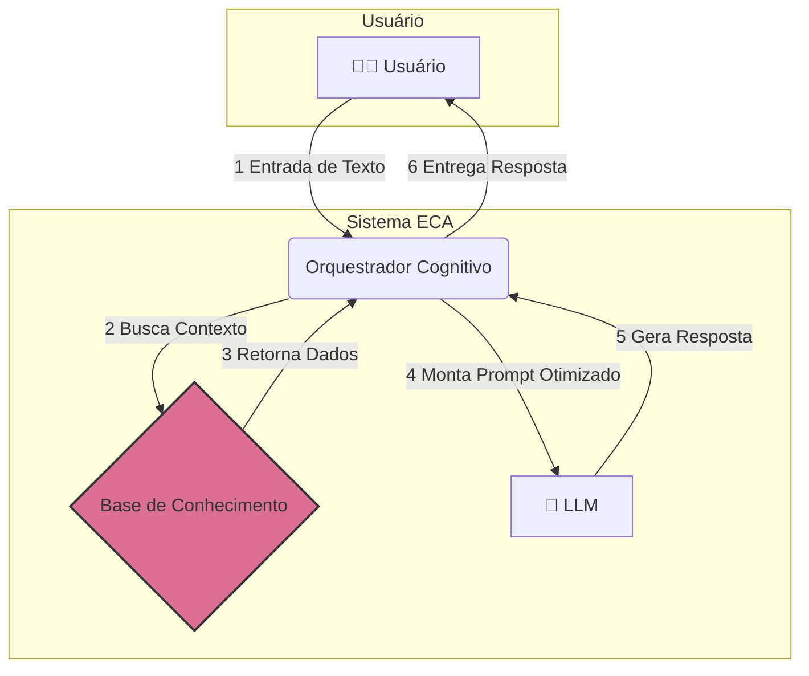
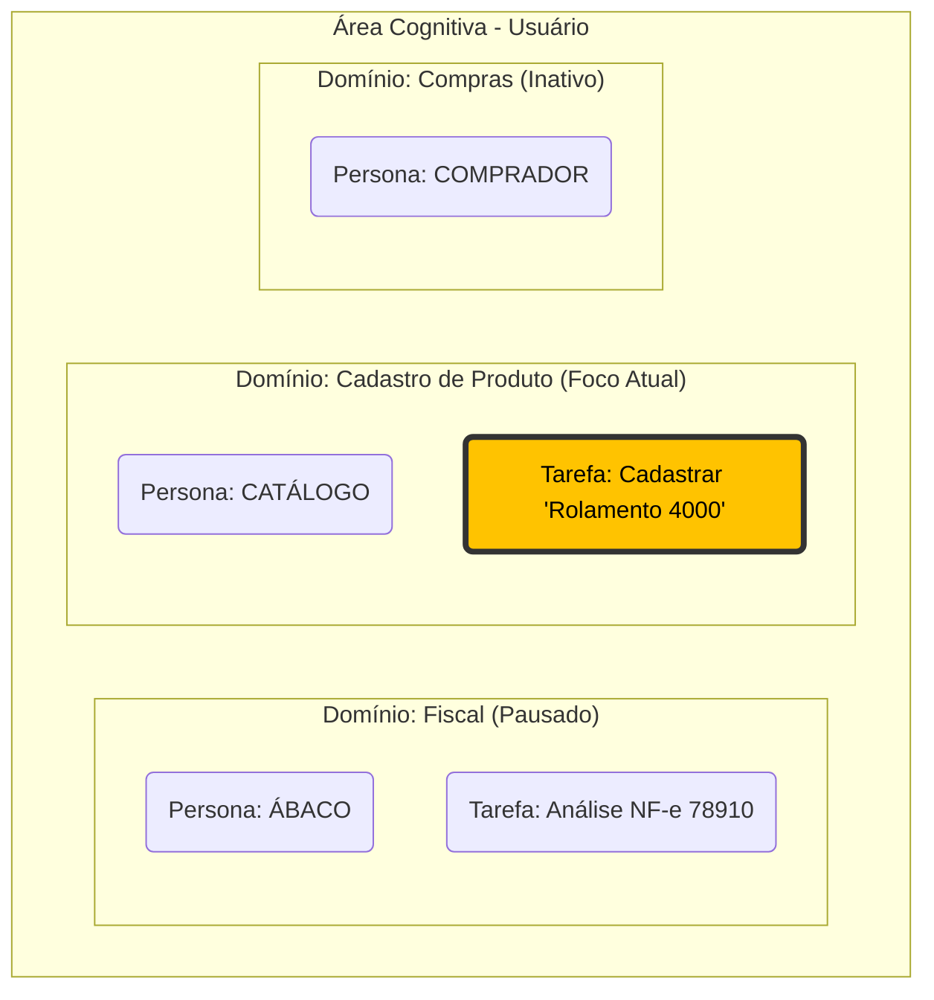
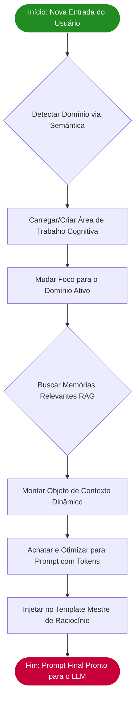

### **Título: ECA: Arquitetura de Engenharia de Contexto Aumentada**

**Versão:** 1.0  
**Autores:** Roberto Timóteo Viera da Silva  
**Data:** 9 de Julho de 2025

## Abstract (Resumo)

Grandes Modelos de Linguagem (LLMs) demonstraram capacidades extraordinárias, mas operam sob uma limitação fundamental: são, por natureza, *stateless* (sem estado), resultando em uma amnésia contextual entre interações. Esta limitação impede a construção de agentes de IA verdadeiramente autônomos, capazes de manter conversas fluidas, alternar entre diferentes domínios de conhecimento e simular um raciocínio contínuo. Este artigo introduz a **Engenharia de Contexto Aumentada (ECA)**, uma arquitetura de orquestração projetada para superar essas limitações. A ECA propõe um sistema dinâmico, orientado por metadados, que gera o contexto para o LLM em tempo real. A arquitetura é composta por uma camada persistente de conhecimento (identidades, memórias, regras de negócio), um orquestrador cognitivo que monta uma "Área de Trabalho Cognitiva" com múltiplos domínios ativos, e uma camada de interface que traduz este estado complexo em um prompt otimizado e nativo para o LLM. Apresentamos um estudo de caso de um agente de backoffice multi-domínio para demonstrar a capacidade da ECA em gerenciar a troca de contexto de forma fluida e manter a coerência, representando um passo significativo em direção a assistentes de IA mais robustos e contextualmente conscientes.

---

## 1. Introdução

A ascensão dos Grandes Modelos de Linguagem (LLMs) redefiniu as fronteiras da interação humano-computador. No entanto, o paradigma de interação predominante, baseado em prompts isolados, trata o LLM como um processador de linguagem sem estado, incapaz de reter memória, evoluir com o contexto ou gerenciar múltiplas linhas de raciocínio simultaneamente.

Essa limitação fundamental impede o desenvolvimento de aplicações sofisticadas que demandam persistência de estado e raciocínio contextual, como assistentes especializados, sistemas de Automação de Processos de Negócio (BPA) e tutores personalizados.

Para endereçar essa lacuna, propomos a Engenharia de Contexto Aumentada (ECA). A ECA não é um novo modelo de LLM, mas sim uma arquitetura de software e um paradigma de design que funciona como um "exoesqueleto" cognitivo para um LLM pré-existente. O princípio central da ECA é: **o pensamento deve ser gerado a partir da intenção e do contexto, não de uma estrutura codificada.**

Este artigo detalha a arquitetura ECA, sua implementação como uma biblioteca Python flexível (`eca-lib`), e sua aplicação prática.

### **Diagrama 1: Visão Geral da Arquitetura ECA**


## 2. Conceitos Fundamentais da ECA

A ECA é construída sobre quatro pilares fundamentais:

* **Personas Dinâmicas e Orientadas a Dados:** As identidades, regras e objetivos dos agentes não são fixos no código. São tratados como dados, carregados de uma fonte persistente, permitindo que os agentes sejam definidos e modificados sem alterar o código da aplicação.
* **Memória em Múltiplas Camadas (RAG):** A arquitetura formaliza a memória em dois tipos: uma "memória de trabalho" de curto prazo para a sessão atual e uma memória semântica de longo prazo, alimentada por Geração Aumentada por Recuperação (RAG). Isso permite que os agentes recordem informações passadas relevantes com base na similaridade contextual.
* **A Área de Trabalho Cognitiva:** O conceito mais inovador da ECA. É uma estrutura de dados em tempo de execução que contém o estado de múltiplos contextos (domínios) simultâneos de um usuário. Permite que um agente "pause" uma tarefa em um domínio (ex: análise fiscal), mude para outro (ex: cadastro de produto) e retorne à primeira tarefa com seu estado totalmente preservado.
* **Orquestração Desacoplada:** A lógica central (o "Orquestrador") é desacoplada das fontes de dados através do Padrão de Projeto *Adapter*. Isso torna a estrutura agnóstica em relação ao banco de dados, ao *vector store* ou ao LLM específico que está sendo usado.

### **Diagrama 2: O Conceito da Área de Trabalho Cognitiva**


## 3. A Arquitetura ECA em Detalhes

A ECA é dividida em camadas lógicas distintas, gerenciadas pelo Orquestrador central.

### 3.1. A Camada Persistente
Este é o "cérebro de longo prazo" do sistema, armazenado em fontes de dados escolhidas pelo usuário (ex: arquivos JSON, um banco de dados SQL ou NoSQL).
* **Personas:** Define os agentes que a IA pode incorporar (ex: "ÁBACO"). Contém sua personalidade, objetivos e regras de ouro.
* **Memórias:** Uma base de conhecimento, idealmente um *vector store*, onde cada entrada é um fato, uma regra de negócio ou um resumo de interação passada, indexada por um vetor de embedding.

### 3.2. A Camada de Abstração (O Padrão Adapter)
Para garantir a flexibilidade, o Orquestrador não interage diretamente com o banco de dados. Ele se comunica através de interfaces abstratas:
* `PersonaProvider`: Responsável por buscar as definições de persona.
* `MemoryProvider`: Responsável por buscar memórias relevantes.
* `SessionProvider`: Responsável por carregar e salvar a Área de Trabalho Cognitiva do usuário.

Desenvolvedores podem implementar essas interfaces para qualquer fonte de dados (ex: `JSONMemoryProvider`, `PostgresMemoryProvider`).

### 3.3. A Camada de Orquestração
Esta é a lógica central contida na classe `ECAOrchestrator`. Para cada requisição do usuário, ela executa um ciclo:
1.  **Detecta** a intenção do usuário para determinar o `domínio` ativo.
2.  **Carrega** a `Área de Trabalho Cognitiva` do usuário através do `SessionProvider`.
3.  **Muda o foco** dentro da área de trabalho para o domínio ativo, pausando os outros.
4.  **Busca** memórias de longo prazo relevantes através do `MemoryProvider`.
5.  **Monta** o objeto de contexto dinâmico completo em memória.

### **Diagrama 3: O Ciclo de Raciocínio do Orquestrador**



### 3.4. A Camada de Geração de Prompt
O objeto de contexto montado, embora completo, pode ser verboso. Esta camada o "achata" para um prompt de texto conciso e estruturado, usando tokens especiais (ex: `[IDENTIDADE:...]`, `[MEMÓRIA_RELEVANTE:...]`). Este prompt otimizado é então injetado em um template mestre que instrui o LLM sobre como raciocinar sobre o contexto fornecido.

```
[INÍCIO_CONTEXTO]
[TIMESTAMP:2025-07-07T14:48:45-03:00]
[IDENTIDADE:ÁBACO|FISCAL|OBJETIVO:Analisar NFs, garantir conformidade e identificar riscos]
[USUÁRIO:Ana|Analista Fiscal Sênior]
[MEMÓRIA_RELEVANTE_1: Fornecedor 'Tecno Peças Ltda' frequentemente apresenta erros no cálculo do IPI na última semana do mês.]
[MEMÓRIA_RELEVANTE_2: Para produtos com NCM iniciado em '8471', a empresa possui um regime especial de tributação de PIS/COFINS.]
[MEMÓRIA_RELEVANTE_3: Regra de Negócio: Toda validação de ICMS-ST deve cruzar a informação com o Protocolo ICMS vigente entre os estados da operação.]
[SESSÃO_ATUAL: Verificação de notas fiscais de entrada do dia 07/07/2025 iniciada.]
[TAREFA_ATIVA: Verificação da Nota Fiscal de Entrada nº 78910 do fornecedor 'Tecno Peças Ltda'.]
[DADOS_INPUT: { "numero_nf": "78910", "fornecedor": "Tecno Peças Ltda", "produto": "Rolamento Axial 3000", "ncm_informado": "8482.10.10", "icms_st_informado": 432.00 }]
[ENTRADA_USUÁRIO: "Ábaco, por favor, analise a NF-e 78910. Verifique o destaque do ICMS-ST e confira se o NCM do produto 'Rolamento Axial 3000' está correto de acordo com nossas regras de negócio."]
[FIM_CONTEXTO]
```

Este formato denso e estruturado reduz a carga cognitiva do LLM, focando sua atenção nos elementos mais pertinentes e melhorando drasticamente a qualidade e a relevância da resposta final.

## 4. Implementação como uma Biblioteca Python (`eca-lib`)

Para tornar esta arquitetura prática, nós a projetamos como uma biblioteca Python, a `eca-lib`. A filosofia da biblioteca é ser não opinativa e fornecer um toolkit robusto para desenvolvedores.

O princípio chave é a **separação de responsabilidades**:
* **A Biblioteca (`eca/`):** Contém a lógica central e reutilizável: `ECAOrchestrator`, `CognitiveWorkspace` e as classes base dos `Adapters`. Ela é agnóstica ao domínio e aos dados.
* **A Aplicação (`examples/`):** Este é o código que o usuário final escreve. O usuário implementa as interfaces dos `Adapters` para se conectar aos seus próprios bancos de dados e fornece seus próprios dados de `personas.json` e `memories.json`.

Essa separação permite que os desenvolvedores aproveitem a poderosa lógica de orquestração da ECA, mantendo total controle sobre seus dados e infraestrutura.

### 4.1. Exemplo de Uso (Quick Start)

Abaixo, um exemplo prático de como um desenvolvedor usaria a `eca-lib` para instanciar o orquestrador e processar uma entrada.

```python
# 1. Importar as classes necessárias
from eca import ECAOrchestrator
from eca.adapters import JSONPersonaProvider, JSONMemoryProvider, JSONSessionProvider

# 2. Apontar para os arquivos de dados da aplicação
personas_file = 'path/to/your/personas.json'
memories_file = 'path/to/your/memories.json'
sessions_file = 'path/to/your/sessions.json'

# 3. Instanciar os provedores (Adapters)
persona_provider = JSONPersonaProvider(file_path=personas_file)
memory_provider = JSONMemoryProvider(file_path=memories_file)
session_provider = JSONSessionProvider(file_path=sessions_file)

# 4. Injetar os provedores no Orquestrador
orchestrator = ECAOrchestrator(
    persona_provider=persona_provider,
    memory_provider=memory_provider,
    session_provider=session_provider
)

# 5. Processar a entrada do usuário
user_id = "ana_paula"
user_input = "Preciso cadastrar um novo produto no sistema."
dynamic_context = orchestrator.generate_dynamic_context(user_id, user_input)

# `dynamic_context` agora contém o estado completo da Área de Trabalho Cognitiva,
# pronto para ser formatado em um prompt para o LLM.
print(dynamic_context)
```

## 5. Estudo de Caso: O Assistente de Backoffice Multi-Domínio

Para validar a arquitetura, implementamos um exemplo de um assistente de backoffice para uma usuária chamada Ana.
1.  **Interação 1 (Domínio: `fiscal`):** Ana pede para analisar uma nota fiscal. O Orquestrador ativa a persona "ÁBACO" e recupera memórias fiscais relevantes.
2.  **Interação 2 (Troca de Contexto):** Ana então pede para cadastrar um novo produto. O Orquestrador detecta a mudança de domínio para `product_catalog`. Ele pausa o estado "fiscal" na Área de Trabalho Cognitiva e ativa a persona "CATÁLOGO", recuperando memórias sobre SKUs.
3.  **Interação 3 (Retorno ao Contexto):** Quando Ana diz, "Ok, voltando àquela nota...", o Orquestrador muda o foco de volta para o domínio `fiscal`, restaurando seu estado anterior e permitindo que o LLM continue a tarefa original com memória total.

Isso demonstra a capacidade da ECA de gerenciar conversas complexas e com múltiplos tópicos, preservando o estado de cada contexto de forma independente.

## 6. Trabalhos Futuros e Direções

A arquitetura ECA fornece uma base sólida para exploração futura:
* **Adaptadores Avançados:** Desenvolvimento de um ecossistema rico de adaptadores para bancos de dados populares (Postgres, MongoDB) e *vector stores* (Pinecone, Chroma).
* **Gerenciamento de Memória:** Implementação de mecanismos sofisticados de "esquecimento" para podar informações irrelevantes ou desatualizadas.
* **Comunicação Inter-Domínios:** Permitir que agentes "conversem" entre si dentro da área de trabalho para resolver problemas inter-funcionais.

## 7. Finalizando

A Engenharia de Contexto Aumentada (ECA) oferece um paradigma estruturado e escalável para construir a próxima geração de agentes de IA. Ao formalizar o gerenciamento de identidade, memória e estado através de uma camada de orquestração desacoplada e do inovador conceito de "Área de Trabalho Cognitiva", a ECA transforma LLMs de ferramentas reativas em parceiros de trabalho proativos, com estado (*stateful*) e contextualmente conscientes. Acreditamos que esta abordagem é um passo fundamental para a realização de interações de IA mais capazes e inteligentes.